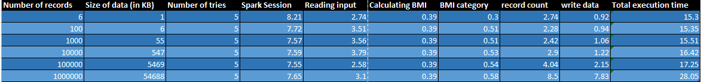
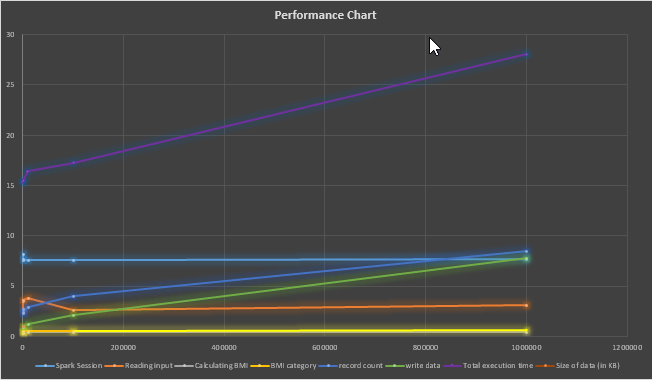
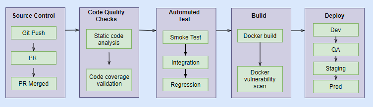

## Python BMI Calculator Coding Challenge V6

### Problem Statement:

Given the following JSON data
<pre>
[{"Gender": "Male", "HeightCm": 171, "WeightKg": 96},
{"Gender": "Male", "HeightCm": 161, "WeightKg": 85},
{"Gender": "Male", "HeightCm": 180, "WeightKg": 77},
{"Gender": "Female", "HeightCm": 166, "WeightKg": 62},
{"Gender": "Female", "HeightCm": 150, "WeightKg": 70},
{"Gender": "Female", "HeightCm": 167, "WeightKg": 82}]
</pre>
as the input with weight and height parameters of a person, we have to perform
the following:
1) Calculate the BMI (Body Mass Index) using Formula 1, BMI Category and
Health risk from Table 1 of the person and add them as 3 new columns
2) Count the total number of overweight people using ranges in the column BMI
Category of Table 1, check this is consistent programmatically and add any
other observations in the documentation
3) Create build, tests to make sure the code is working as expected and this
can be added to an automation build / testing / deployment pipeline

**Formula:**
<pre>

BMI(kg/m2) = mass(kg) / height(m)2

The BMI (Body Mass Index) in (kg/m2) is equal to the weight in kilograms (kg)
divided by your height in meters squared (m)2. 
For example, if you are 175cm(1.75m) in height and 75kg in weight,
you can calculate your BMI as follows: 75kg/ (1.75m²) = 24.49kg/m²
</pre>

**Table 1 - BMI Category and the Health Risk.**

BMI Category | BMI Range (kg/m2) | Health risk
--- | --- | --- |
Underweight | 18.4 and below |Malnutrition risk
Normal weight | 18.5 - 24.9 |Low risk
Overweight | 25 - 29.9 |Enhanced risk
Overweight | 30 - 34.9 |Medium risk
Severely obese | 35 - 39.9 |High risk
Very severely obese | 40 and above |Very high risk

### Data wrangling

* The input data is in the schema given below:
    <pre>
    root
     |-- Gender: string (nullable = true)
     |-- HeightCm: long (nullable = true)
     |-- WeightKg: long (nullable = true)    
    </pre>

Fields |Type|Description
--- | --- | --- |
Gender | String| Persons Gender
HeightCm |Integer| Height in centimeter
WeightKg | Integer| Weight in Kilogram

**Data processing:**
* Read the input JSON from the input folder in resources folder.
* Calculate the BMI value for each record.
* Derive the BMI category and Health risk from the BMI value calculated in previous step.
* Count the records of people having the BMI category as "Overweight".
* Write the computed dataframe to the output folder under resources table.
* The output csv file will be written in folder path partitioned by date.

**Final Output:**

For the Sample data provided,

**Total number of records having the BMI category as 'Overweight' is 1.**

### Running the application:
i.  Clone the repository from GitHub.

ii. Go to the project folder. Run the below command in terminal.
<pre>
pip install -r requirements.txt
</pre>

iii. Go to src-->app-->main.py

iv.  Run the application. 

V. Output csv data is in the 'output' folder.

Unit test for the application done using Pytest library.

### Performance Metrics:
The sample data contains only 6 records.
The application needs to scale up to operate on 100000 records.
Below table contains the performance metrics captured for different input record count.

**Performance Metrics Data:**

**Performance Graph:**

### CI/CD implementation:

* The application can be packaged containerized using docker.
* For CI/CD, before running the application we can perform the below mentioned step:
  

**i. Source control:**

* The code pushed into the repo and a pull request is raised.
* After review the code, the code is merged to the branch.

**ii. Code quality checks:**

* Static code analysis on the project is performed to detect any bug or tech debts in code.
* Code coverage report is generated for the unit testing.
* The build can be marked as failed if the code quality is met according to the policy.
* For example if there is any bug in code or if code coverage report is less than 75%, the build can be failed.
* This ensures that only the quality code is deployed into the environment.

**iii. Automated tests:**

* Smoke test is executed to check if the basic functionality is working as expected.
* This ensures application with broken functionality is not deployed.
* Integration testing is done to check all the integration points of the application.
  Change in one of the service must not break the application.
* Regression testing is done to ensure the application passes all the validations and 
working as expected. Here the postive and negative senarios are tested in detail. 
* Build will be marked as failure if any of the test fails at any stage.

**iv. Build:**
* The docker image is built and tagged with version.
* Vulnerability scan on the docker image finds if there are any vulnerability in the image
or its dependencies.
* It also highlights if any library is to be updated. 
* If any vulnerability is detected, the build will be marked as failure. This is important 
so that application with any security issue is not deployed. 
  
**v. Deploy:**
* Once All the checks are done, the docker image can be deployed to the servers.